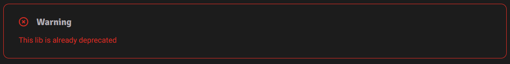

[](https://crates.io/crates/gxi_hako)
[](https://docs.rs/gxi_hako)
[](https://github.com/zoneherobrine/gxi_hako/actions)
[](https://blog.rust-lang.org/2022/02/24/Rust-1.77.2.html)


<hr />



# Deprecated
这个库基本上已经停止维护了，或者说已经被整合进了新的库之中，新的库是GXCI，它包含大恒相机SDK本地相机部分的全部原生实现，并且提供了对应的HAL封装，可以在[github](https://www.github.com/zoneherobrine/gxci)和[crates](https://crates.io/crates/gxci)上查看

This project is deprecated, or it has been integrated into a new project, the new project is GXCI, it's in[github](https://www.github.com/zoneherobrine/gxci) and [crates](https://crates.io/crates/gxci), which has FULL RAW IMPLEMENTATION of the local camera part of Daheng Imaging SDK, and it provides HAL functions.


# Introduction
gxi_hako是一款用Rust基于GxIAPI的库进行大恒工业相机的接口开发;

目前已实现本地相机的所有接口，enums还没有完全迁移过来，并在utils内便写了一些工具类函数，方便使用

gxi_hako is developing the interface of Daheng Industrial Camera using Rust based on GxIAPI library;

At present, all interfaces for the local camera have been implemented, and the enums have not been completely migrated. Some utility functions have been written in utils to facilitate use.

# Overview
The sdk-dev-doc is contained in ./doc/sdk,here I only provide the English version of the sdk-dev-doc, and the Chinese version is not provided here(Because the 10MB limitation of crates.io).

You can also get the sdk-dev-doc from the SDK of Daheng Imaging you have installed.

# Quick Start
Following code is same as the list_devices_info.rs in the examples directory:
```rust

use std::mem::size_of;
use gxi_hako::{
    gx::{
        gx_interface::*, 
        gx_struct::*,
    },
    utils::{
        debug::print_device_info,
        builder::GXDeviceBaseInfoBuilder,
    },
};

fn main() {
    unsafe {
        // You can change the library path as you need
        let gx = GXInstance::new("C:\\Program Files\\Daheng Imaging\\GalaxySDK\\APIDll\\Win64\\GxIAPI.dll").expect("Failed to load library");
        gx.gx_init_lib().expect("Failed to initialize library");

        let mut device_num = 0;
        gx.gx_update_device_list(&mut device_num, 1000)
            .expect("Failed to update device list");

        if device_num > 0 {

            let mut base_info: Vec<GX_DEVICE_BASE_INFO> = (0..device_num).map(|_| {
                GXDeviceBaseInfoBuilder::new().build()
            }).collect();
            
            // or you can use the following code to initialize the vector without using the builder

            // let mut base_info = vec![
            //     GX_DEVICE_BASE_INFO {
            //         szVendorName: [0; GX_INFO_LENGTH_32_BYTE],
            //         szModelName: [0; GX_INFO_LENGTH_32_BYTE],
            //         szSN: [0; GX_INFO_LENGTH_32_BYTE],
            //         szDisplayName: [0; GX_INFO_LENGTH_128_BYTE],
            //         szDeviceID: [0; GX_INFO_LENGTH_64_BYTE],
            //         szUserID: [0; GX_INFO_LENGTH_64_BYTE],
            //         accessStatus: GX_ACCESS_STATUS_CMD::Unknown,
            //         deviceClass: GX_DEVICE_CLASS::Unknown,
            //         reserved: [0; 300],
            //     };
            //     device_num as usize
            // ];

            let mut size = (device_num as usize) * size_of::<GX_DEVICE_BASE_INFO>();
            let status = gx
                .gx_get_all_device_base_info(base_info.as_mut_ptr(), &mut size)
                .expect("Failed to get all device base info");

            if status == 0 {
                // Assuming 0 is GX_STATUS_SUCCESS
                println!(
                    "Device base info retrieved successfully. Number of devices: {}",
                    device_num
                );
                for device in &base_info {
                    print_device_info(&device);
                }

            } else {
                println!("Failed to retrieve device base info, status: {}", status);
            }
        } else {
            println!("No Devices found.");
        }

        gx.gx_close_lib().expect("Failed to close library");
        println!("Library closed.")
    }
}

```

# Usage
You can see the GXInstance part(where impl the GXInterface trait with rust-doc) in gx_interface doc , the link is [here](https://docs.rs/gxi_hako/0.1.2/gxi_hako/gx/gx_interface/struct.GXInstance.html)

# Example
Here 5 examples are provided, which are:
- [x] list_devices_info.rs: list all the devices' information
- [x] open_device_by_index.rs: open the device by index
- [x] open_device_by_sn.rs: open the device by serial number
- [x] get_image.rs: get the image from the camera
- [x] callback_capture.rs: register the callback function to capture the image realtimely

You can run the example by the following command:
```shell
cargo run --example list_devices_info
```

# Dependencies

## OpenCV Environment
The OpenCV lib here is only used to easily provide a GUI to show the image, so you can ignore this part if you don't want to show the image.

### Install LLVM and OpenCV 4.9.0
In Windows 10/11, I would like using choco as the following command to install LLVM and OpenCV 4.9.0:

```shell
choco install llvm opencv
```

Following are the websites:
- [LLVM](https://releases.llvm.org/download.html)
- [OpenCV](https://opencv.org/releases/)
- [choco](https://chocolatey.org/)

### Add the path environment variable
You can add the following path to the path environment variable:

- opencv bin path ...\opencv\build\bin
- opencv x64 bin path ...\opencv\build\x64\vc16\bin
- choco bin path C:\ProgramData\chocolatey\bin
- LLVM bin path C:\Program Files\LLVM\bin

Here is an example:
```
D:\ProgramUnsigned\Embedded\opencv\build\bin 
D:\ProgramUnsigned\Embedded\opencv\build\x64\vc16\bin
C:\ProgramData\chocolatey\bin
C:\Program Files\LLVM\bin
```

### Add opencv environment variable(System Variable)

OPENCV_INCLUDE_PATHS ...\opencv\build\include
OPENCV_LINK_LIBS opencv_world490
OPENCV_LINK_PATHS ...\opencv\build\x64\vc16\lib

here is an example:
```
OPENCV_INCLUDE_PATHS D:\ProgramUnsigned\Embedded\opencv\build\include
OPENCV_LINK_LIBS opencv_world490
OPENCV_LINK_PATHS D:\ProgramUnsigned\Embedded\opencv\build\x64\vc16\lib

```

### Copy opencv_world490.dll to the target directory (if needed)
Sometimes, you need to copy the opencv_world490.dll to the target directory, which is the same as the exe file.

## GxIAPI Environment
You also need to install the GxIAPI SDK, which can be downloaded from the [official website](https://www.daheng-imaging.com/downloads/).

Just install the SDK for your platform.

## Camera Environment
You need to connect the camera to your computer, and make sure the camera is powered on.

Then all the environment is ready.

# Camera Support
- [x] USB3.0 Camera
  - [x] Mer Camera (Mono8, Mono10)
- [ ] Gige Camera


# Platform Support
Now, is Windows only.

# Licensing

Licensed under the MIT License.

# Contributing
Uhmmm... placeholder

# Acknowledgments
pLaShOlDeR~


# Todolist
- [x] Get-Set 函数补全
- [x] 本地相机函数补全
- [x] 项目重构，等有闲的时候重构
- [x] 基本的example
- [x] 发布crate，重构完就发布
- [ ] 更多的examples
- [ ] 更多的doc说明
- [ ] async/await的支持，引入tokio
- [ ] 补全网络相机(Gige)相关的函数
- [ ] 补全FeatureID的枚举
- [ ] Linux平台支持
- [ ] 更多相机类型

# DLL implemented status
- [x] 302    0 0001C020 GXCloseDevice
- [x] 101    1 0001BBC0 GXCloseLib
- [x] 700    2 0001E9E0 GXExportConfigFile
- [ ] 707    3 0001EA50 GXExportConfigFileW  ?在开发文档里面没介绍这个函数
- [x] 602    4 0001E920 GXFlushEvent
- [x] 505    5 0001E6E0 GXFlushQueue
- [x] 201    6 0001BDE0 GXGetAllDeviceBaseInfo
- [x] 414    7 0001D5F0 GXGetBool
- [x] 419    8 0001E080 GXGetBuffer
- [x] 418    9 0001DF50 GXGetBufferLength
- [ ] 205    A 0001BE80 GXGetDeviceIPInfo
- [ ] 423    B 0001C0B0 GXGetDevicePersistentIpAddress
- [x] 411    C 0001D3C0 GXGetEnum
- [x] 410    D 0001CF50 GXGetEnumDescription
- [x] 409    E 0001CE20 GXGetEnumEntryNums
- [x] 506    F 0001E970 GXGetEventNumInQueue
- [x] 422   10 0001C1E0 GXGetFeatureName
- [x] 408   11 0001CCF0 GXGetFloat
- [x] 406   12 0001C960 GXGetFloatRange
- [x] 504   13 0001E670 GXGetImage
- [x] 404   14 0001C730 GXGetInt
- [x] 403   15 0001C590 GXGetIntRange
- [x] 204   16 0001BC40 GXGetLastError
- [ ] 709   17 0001F370 GXGetOptimalPacketSize  (Windows Only)
- [x] 416   18 0001DAA0 GXGetString
- [x] 415   19 0001D820 GXGetStringLength
- [x] 425   1A 0001D970 GXGetStringMaxLength
- [ ] 705   1B 0001EEF0 GXGigEForceIp
- [ ] 704   1C 0001ECC0 GXGigEIpConfiguration
- [ ] 706   1D 0001F170 GXGigEResetDevice
- [x] 701   1E 0001EAC0 GXImportConfigFile
- [ ] 708   1F 0001EB40 GXImportConfigFileW  ?在开发文档里面没介绍这个函数
- [x] 100   20 0001BB70 GXInitLib
- [x] 400   21 0001C260 GXIsImplemented
- [x] 401   22 0001C370 GXIsReadable
- [x] 402   23 0001C480 GXIsWritable
- [x] 301   24 0001BFB0 GXOpenDevice
- [x] 300   25 0001BF10 GXOpenDeviceByIndex
- [ ] 702   26 0001EBC0 GXReadRemoteDevicePort
- [ ] 710   27 0001F3E0 GXReadRemoteDevicePortStacked
- [x] 500   28 0001E5B0 GXRegisterCaptureCallback
- [x] 600   29 0001E730 GXRegisterDeviceOfflineCallback
- [x] 603   2A 0001E820 GXRegisterFeatureCallback
- [x] 421   2B 0001E480 GXSendCommand
- [x] 507   2C 0001F100 GXSetAcqusitionBufferNumber
- [x] 413   2D 0001D720 GXSetBool
- [x] 420   2E 0001E350 GXSetBuffer
- [ ] 424   2F 0001C160 GXSetDevicePersistentIpAddress
- [x] 412   30 0001D4F0 GXSetEnum
- [x] 407   31 0001CBE0 GXSetFloat
- [x] 405   32 0001C860 GXSetInt
- [x] 417   33 0001DDC0 GXSetString
- [x] 501   34 0001E620 GXUnregisterCaptureCallback
- [x] 601   35 0001E7B0 GXUnregisterDeviceOfflineCallback
- [x] 604   36 0001E8B0 GXUnregisterFeatureCallback
- [x] 206   37 0001BD70 GXUpdateAllDeviceList
- [x] 200   38 0001BD00 GXUpdateDeviceList
- [ ] 703   39 0001EC40 GXWriteRemoteDevicePort
- [ ] 711   3A 0001F450 GXWriteRemoteDevicePortStacked (Windows Only)